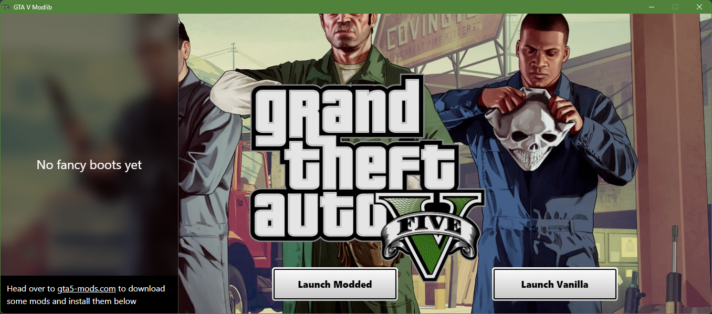

    

#### THIS IS A WORK-IN-PROGRESS!

# GTA V Modlib
GTA V Modlib is a program that allows you to import, install and manage your GTA V mods all while being lightweight and easy to use.

## How it works
Upon opening **GTA V Modlib.exe** up, you'll b met with this UI resembling the Rockstar Launcher:

In the bottom left you'll be prompted to download mods from [gta5-mods.com](https://gta5-mods.com) and install them in GTA V Modlib

In the middle, you'll see two buttons: Launch Modded & Launch Vanilla. It's as easy as clicking one of those two buttons to switch between modded and vanilla GTA V in a matter of seconds[$^1$](#disclaimers)

In the left panel you can also switch mods on and off individually.

## Contributing and technologies
GTA V Modlib is built with **TypeScript** and **Python**: TypeScript is used in conjunction with **React** to create the front-end render build and python is used to put everything inside a nice window with **pywebview** and interfafce with the system with **easygui** and native Python APIs.

If you have knowledge in **React**, **Typescript** or **Python** feel free to modify and submit a pull request, help is always welcome!

#### Disclaimers
1. Depending on the speed of your storage device